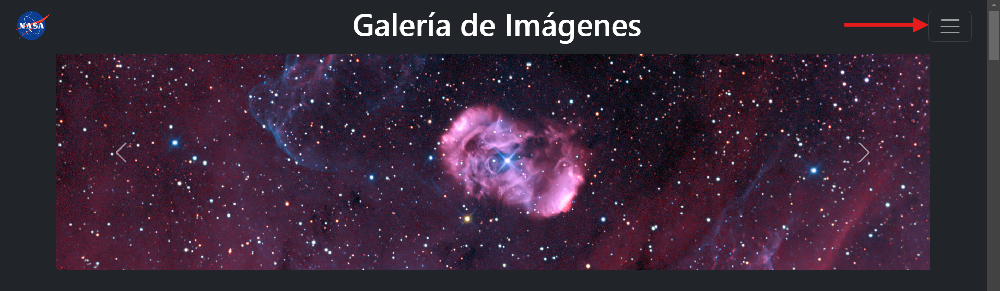
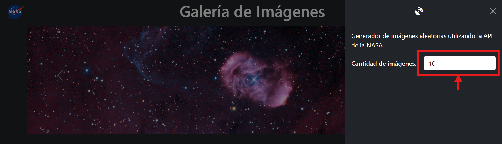
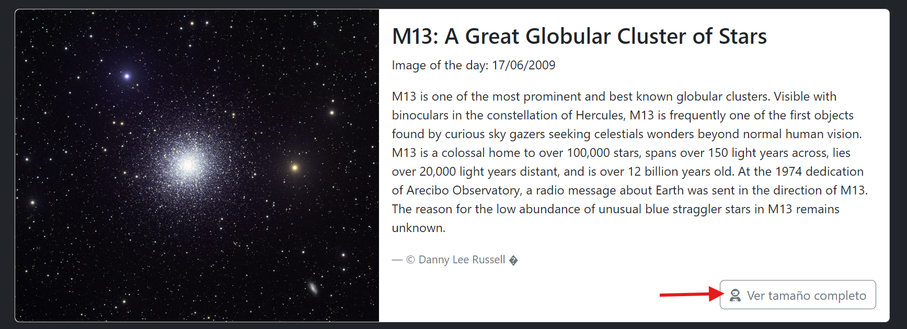

# Galería de Imágenes de la NASA

<aside>
 Link = [https://anaguirv.github.io/react_imagesNasa/](https://anaguirv.github.io/react_imagesNasa/)

## Descripción del Proyecto

Este proyecto es una galería de imágenes de la NASA construida con React, Vite y Bootstrap. Utiliza la API de Astronomy Picture of the Day (APOD) de la NASA para obtener imágenes de forma aleatoria  y mostrarlas en un carrusel y en tarjetas. Los usuarios pueden seleccionar la cantidad de imágenes a mostrar desde un menú de navegación y cada que se actualiza el número se cargará un nuevo lote de imágenes.

### Guía de uso

- Acceder a la página [https://anaguirv.github.io/react_imagesNasa/](https://anaguirv.github.io/react_imagesNasa/)
- Presionar botón del la barra de navegación.
    
    
    
- Ingresar cantidad deseada.
    
    
    
- Cada imagen tiene un enlace directo a ver la imagen de tamaño completo si se desea descargar.
    
    
    

## Tecnologías Utilizadas

- **React**: Biblioteca de JavaScript para construir interfaces de usuario.
- **Vite**: Herramienta de construcción rápida para proyectos web modernos.
- **Bootstrap**: Framework de CSS para diseño responsive.
- **NASA APOD API**: API que proporciona la imagen del día de la NASA.
    
    > [https://api.nasa.gov/](https://api.nasa.gov/)
    > 

## Estructura del Proyecto

```bash
react_imagesNasa/
│
├── public/
│   ├── nasa-ico.svg
│   └── nasa-logo.svg
│
├── src/
│   ├── components/
│   │   ├── ImageCard.jsx
│   │   ├── ImageCarousel.jsx
│   │   └── NavBar.jsx
│   │
│   ├── data/
│   │   └── API.jsx
│   │
│   ├── main.jsx
│   ├── App.jsx
│   └── index.css
│
├── .github/
│   └── workflows/
│       └── deploy.yml
│
├── vite.config.js
├── package.json
└── README.md

```

## Utilizar en servidor local

1. **Clonar el Repositorio**
    
    ```bash
    git clone https://github.com/Anaguirv/react_imagesNasa.git
    cd react_imagesNasa
    ```
    
2. **Instalar Dependencias**
    
    ```bash
    npm install
    ```
    
3. **Ejecutar el Proyecto en Desarrollo**
    
    ```bash
    npm run dev
    ```
